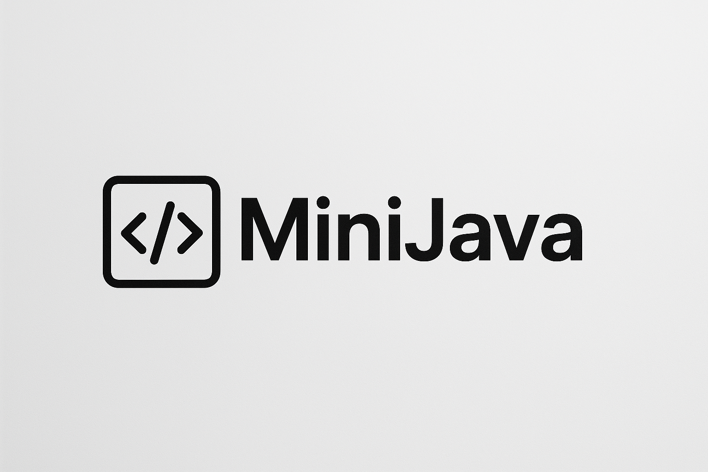

<br>

<table align="center">
  <tr>
    <td align="center" style="padding-top: 20px;">
      
    </td>
  </tr>
</table>

<p align="center">
  
  
  
  
  
  
  
  
  
</p>


---

##  Pré-requisitos

- Java JDK 11+ instalado

- ANTLR 4.13.1 jar disponível no projeto (em lib/)

- (Opcional) Visual Studio Code + extensões de Java + extensões do Antlr

- Graphviz 12.2.1+ instalado

##  Objetivo do Projeto

O objetivo principal deste projeto é ***desenvolver um compilador funcional*** como requisito obrigatório para aprovação na disciplina de Compiladores. O compilador deve ser capaz de processar uma linguagem definida por uma gramática própria e realizar:

- ***Analise lexica***: identificar tokens a partir de um arquivo-fonte, gerando saídas no formato `<Tipo do Token, Lexema, Linha, Coluna>`, com logs detalhados e mensagens claras de erro.
- ***Analise sintatica***: validar a estrutura do código-fonte de acordo com a gramática definida, gerando uma `AST (árvore sintática abstrata)` e emitindo mensagens de erro intuitivas.
- ***Execução de testes*** com programas como:
    - Geração do **Triângulo de Pascal** (para testar laços e estruturas de repetição);
    - **Classificação de triângulos** (para testar expressões lógicas e condicionais aninhadas).

##  Como compilar e rodar

### 1. Gerar o Lexer, Parser, Listener e Visitor com ANTLR

Execute o comando abaixo:

```bash
java -Xmx500m -cp "lib/antlr-4.13.1-complete.jar" org.antlr.v4.Tool -Dlanguage=Java -visitor -o src/main/java/com/minijava/antlr src/main/java/com/minijava/grammar/MiniJava.g4
```

- Isso gera os arquivos necessários dentro da pasta antlr.

### 2. Compilar o projeto

Compile todos os arquivos .java:

```bash
mvn clean package
```
ou
```bash
mvn clean install
```

- Os .class serão gerados dentro da pasta target/.

### 3. Rodar o interpretador

Execute o programa:

```bash
mvn exec:java
```

- O interpretador irá ler o arquivo input/triangulo_pascal.txt (ou outro arquivo configurado) e interpretar os comandos.

##  Expressões

A linguagem suporta:

- Concatenação de strings e números com `+`
- Operações aritméticas (`+`, `-`, `*`, `/`)
- Expressões lógicas (`&&`, `||`, `!`)
- Comparações (`==`, `>`, `<`, `>=`, `<=`)

##  Tokens

- **ID**: identificadores ([a-zA-Z_][a-zA-Z0-9_]*)
- **INT**: inteiros ([0-9]+)
- **STRING**: cadeias de caracteres entre aspas (`"texto"`)
- **WS**: espaços e quebras de linha (ignorado)
- **COMMENT**: comentários de linha iniciados com `//` (ignorados)

##  Exemplo de Código

```bash
class Main {
    int x;
    string nome;

    scanf(x);
    nome = "João";
    x = x + 5;

    if (x > 10) {
        println(nome);
    } else {
        print("Valor baixo");
    }

    while (x < 20) {
        x = x + 1;
    }
}
```

##  Estrutura de pastas

```bash
MiniJava
├─ docs                           # pasta docs para o readme
├─ input                          # Pasta onde ficam os arquivos de teste para rodar o programa
├─ output                         # Pasta output de arquivos gerados pelo programa como tokens, dots e imagens.     
│  ├───dot
│  │   └───svgs
│  └───tokens
├─ lib                            # Biblioteca ANTLR
│  └─ antlr-4.13.1-complete.jar
├─ LICENSE
├─ pom.xml
├─ README.md
└─ src
   └─ main
      └─ java
         └─ com
            └─ antlrjavacompiler
               ├─ antlr           # Lexer, Parser, Listener e Visitor gerados
               ├─ ast             # Pasta de arquivos que manipulam ast
               │  ├─ dot          # Gerador dot
               │  │  └─ DotGenerator.java
               │  ├─ image        # Gerador de imagem do ast a partir do dot
               │  │  └─ AstImageGenerator.java
               │  └─ viewer       # Visualizador da tree ast 
               │     └─ AstViewer.java
               ├─ classcheck      # Verificação da classe se o nome condiz com o nome do arquivo
               │  └─ ClassVerification.java
               ├─ exception       # Tratamento de erros personalizados
               │  ├─ LexerErrorListener.java
               │  └─ ParserErrorListener.java
               ├─ grammar         # Pasta da gramatica do projeto
               │  └─ MiniJava.g4
               ├─ interpreter     # Interpretador da linguagem
               │  └─ Interpreter.java
               ├─ Main.java
               └─ tokengenerator  # Gerador de tokens já formatado
                  └─ TokenGenerator.java

```
##  Licença

Este projeto está licenciado sob a [Licença MIT](LICENSE).